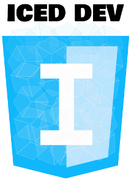
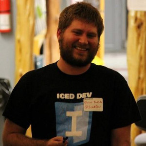

# Firefox OS Game Dev <br> with FrozenJS

--





@monteslu | @iceddev | @blainebublitz

--


[frozenjs.com](http://frozenjs.com)

--

# HTML5 Game Engine

* Open-source
* Easy to use
* Rapid development through tooling
* Modular

--

# Zero to 60


--

# Installation

`> npm install -g yo generator-frozen`

* Requires Node.js and NPM
* Will install Bower and Grunt

--

# Start Your Game

```bash
> mkdir wicked-game && cd $_
> yo frozen
```

--

# Questions, Questions

