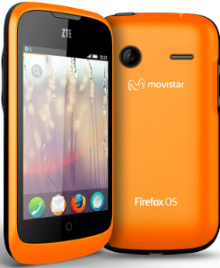
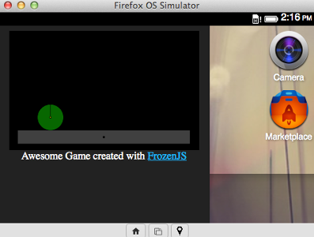
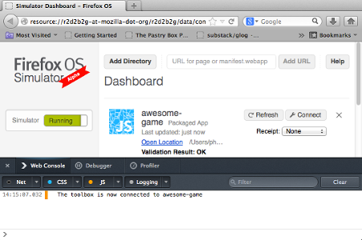
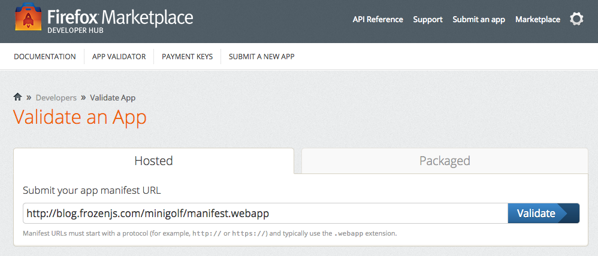
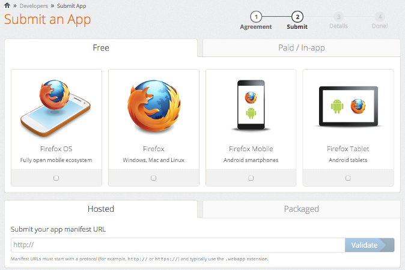

# Firefox OS Game Dev <br> with FrozenJS

--


@monteslu | @iceddev | @blainebublitz

--


[frozenjs.com](http://frozenjs.com)

--

# HTML5 Game Engine

* Open-source
* Easy to use
* Rapid development through tooling
* Modular

--

# WebKit (Blink)

## Not the only game in town


--

# Firefox OS

* Mobile OS
* Open-source
* HTML, CSS & JS
* Expose device APIs to web tech
* No vendor lock-in

--

# Available Now





Geeksphone Keon | ZTE Open | Alcatel One Touch Fire

Developer Device | Telefonica - Spain | T-Mobile - Poland

--

# Distribution

* Installable from websites
* Firefox Marketplace - [Link](https://marketplace.firefox.com/)
	* Packaged Apps
	* Hosted Apps
* Free & Paid + In-app purchasing

--

# Zero to 60


[Yeoman](http://yeoman.io/) | [Grunt](http://gruntjs.com/) | [Bower](http://bower.io/)

--

# Installation

`> npm install -g yo generator-frozen`

* Requires Node.js and NPM
* Will install Bower and Grunt
* [Frozen Generator](https://npmjs.org/package/generator-frozen)

--

# Scaffold Your Game

```bash
> mkdir wicked-game && cd $_
> yo frozen
```

Answer some questions, wait, then

```bash
> grunt
```

--

# Write Your Game

--

# Test Your Game

* Firefox OS Simulator - [Link](https://addons.mozilla.org/en-us/firefox/addon/firefox-os-simulator/)
* Firefox for Android - [Link](https://play.google.com/store/apps/details?id=org.mozilla.firefox&hl=en)
* Desktop Firefox



--

# Publish Your Game

```bash
> git checkout -b gh-pages
> git push origin gh-pages
```

Github Pages serve `.webapp` files with `Content-Type: application/x-web-app-manifest+json` header

[Serving Manifests](https://developer.mozilla.org/en-US/docs/Web/Apps/Manifest#Serving_manifests)

--

# Validate Your Manifest



[Validator](https://marketplace.firefox.com/developers/validator)

--

# Submit Your Game



[Submission Form](https://marketplace.firefox.com/developers/submit/)
